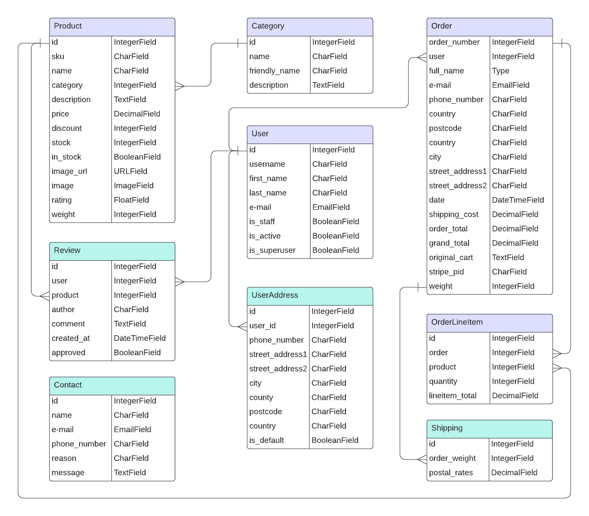

# 
T-STUDIO

## Contents:
- <a href="#ux">UX</a>
    - <a href="#strategy">Strategy</a>

## 
UX

### Overview
<a href="https://healing-massage-yoga.business.site/?utm_source=gmb&utm_medium=referral" target="_blank">T-Studio business is a real startup</a> dedicated to improving the well-being of our neighbors bringing a fresh perspective to the world of integrated services. Our offerings are designed with mind, body and spirit in mind, providing an environment for relaxation, rejuvenation and self-care. We are committed to providing our customers with a seamless online shopping experience, allowing them to explore and purchase our carefully selected selection of needle applicators from the comfort of their homes. Through our e-commerce site, we strive to make health accessible to everyone. By offering these innovative purchasing tools, we extend the benefits of our services beyond our physical location, making wellness accessible to our customers wherever they are.

Our e-commerce platform integrates seamlessly with our local services. Our customers can not only purchase needle applicators online but also receive information about our yoga and massage services, creating a holistic and comprehensive wellness experience. Our goal is to offer services targeted specifically to the local community. Our e-commerce site serves as a digital hub connecting our local customers to the wellness resources they are looking for. We take the time to understand everyone's unique needs, ensuring a personalized service. We are proud to be a part of the local community, committed to contributing positively to the well-being of our neighbors.

Our e-commerce site features informative content, guides, and tips to empower our customers on their well-being journey.

#### Target audience
- People who prefer to shop online and need relaxation
- People who are looking for a non-invasive way to alleviate pain with needle applicators
- People who need improved blood circulation can benefit from needle applicators
- Local people who are looking to relax and reduce muscle tension
- Local people who need to recover from injury
- Local people who are looking for a natural way to improve their health and wellness with yoga classes
- Local people who are seeking to improve their overall well-being and in need of an individual approach
- Stressed parents who would like to get a break from the daily stresses of parenting with our massage therapy

#### Business Goals
- To create a professional e-commerce site
- To provide users with information on holistic well-being through service descriptions to build trust and brand loyalty
- To provide an easy and secure means to purchase items
- To increase the customer base of the existing business
- To create a brand for the store and increase brand awareness

#### Customer Goals
- To find information about products and services that meet their expectations to build trust and brand loyalty
- To navigate easily and intuitively through the website with a clear purpose
- To make a hassle-free purchase quickly, easily and securely
- To view a list of reviews and ratings for each product to know how good this product is.
- Be able to contact the business owner if any questions arise.

---

### 
Strategy

Determining the best approach meant studying the needs of the e-commerce site's potential users.  I found that the availability of information for unregistered users is important, including placing an order in the online store and securing payment for the order.

Those wishing to register require simple registration with a verification code sent by email, convenient login, quick and convenient ordering in the store, secure payment and the ability to save data in a personal profile. It is also necessary to provide users the ability to create, read, update and delete their profile data (CRUD).

Features of this site are the ability for a registered user to add shipping addresses and change the default address, the ability to add a review to each purchased product, and the availability for all users to view all reviews approved by admin on the `product_detail` page.

For ease of administration, not only an interface has been created for adding and editing products in the online store, but also the ability for the admin to view new reviews and approve them.

Another convenient function is the calculation of the cost of delivery of an order, based on the weight of each item and the delivery cost, which are stored in the database.

#### Agile
The Agile methodology was used to plan the project. Github was used as the tool to demonstrate this. Each user story was linked to an Epic and placed within one of three Iterations. Issues were used to create User Stories with custom templates ([Link to Kanban board](https://github.com/users/OlgaKuvs/projects/4/views/1)).

##### User Stories
Issues were used to create User Stories. I added the acceptance criteria and the tasks so I could track my work effectively. Once I completed a User Story I would move it from `in progress` to `done`.

- Completed User Stories: 

    

    
EPIC: Navigation & Views 

    * As a user, I can view a list of products so that I can decide if I wish to purchase anything. 
    * As a user, I want to see detailed product information so that I can decide whether to make a purchase based on the price, description and option availability. 
    * As a user, I can navigate the website easily and intuitively so I can explore the website freely. 
    * As a user, I want to be able to browse products so that I can easily find what I'm looking for. 
    

    

    
EPIC: User Profile 

    * As a user, I can create an account so that I can access my personal information and order history. 
    * As a registered user, I can view my order history so that I know what I have already ordered. 
    * As a registered user, I can edit my user information so that I can have the correct information. 
    

    

    
EPIC: Shopping 

    * As a customer, I can add items to a cart so that I can navigate to other products without losing my order. 
    * As a customer, I can remove items from my cart to change my selections or not place an order. 
    * As a customer, I can receive a message on the changes I make to my cart so that I know if the items were added, deleted or updated successfully. 
    * As a customer, I may receive an email notification that my order has been successfully placed so that I have order confirmation. 
    * As a customer, I can complete the payment process quickly and easily so that keep the information secure and private. 
    

    

    
EPIC: Reviews 

    * As a user, I can post reviews on items that I have purchased so that I can advise others if this product is worth purchasing. 
    * As a customer, I can view a list of reviews for each product so that I can find out if customers are satisfied with the product. 
    * As a customer, I can view each product rating to know how good this product is. 
    

    

    
EPIC: Newsletter 

    *  As a customer, I can sign up for a newsletter so that I can get access to special offers or promotions. 
    

    

    
EPIC: Store Management 

    * As a store owner, I can manage orders based on queries from customers so that the orders are correct. 
    * As a store owner, I can add, edit and delete products in the store so that I can effectively manage store operations. 
    * As a store owner, I want to be able to set and change shipping rates to match carrier rates. 
    

     

    
EPIC: Contact and Business Information 

    * As a customer, I can contact the business owner so that I can communicate with a person. 
    

- Uncompleted User Stories: 

    The following User Stories were not completed and moved into the NTH (`Nice To Have` column of [Kanban board](https://github.com/users/OlgaKuvs/projects/4/views/1)) because they were not considered necessary for this project currently (added to future features) and due to time constraints:

    * As a store owner, I can determine product availability to ensure good UX and meet customer expectations. 
    * As a customer, I can unsubscribe from the newsletter so that I no longer receive unwanted content. 

    User stories related to Business Information only require creating HTML pages and filling them with information, do not include any functionality and are therefore left for the future due to time constraints:

    * As a customer, I would like to know how to return the product so that I can make a return and receive a refund.
    * As a customer, I can read Frequently Asked Questions so that I can find answers to my questions. 

- This user story was partially completed and placed in NTH (`Nice To Have`) column of Kanban board. The user can see information about the shipping price, but the delivery time is not indicated:

    * As a customer, I can view delivery information so that I am informed about delivery charges and time.

    <a href="#up">Back to Top of page</a>

    ---

     ### 
Database structure

    

    From the very beginning of the project, I knew that I first needed to understand the structure of the database and the relationships between tables. I have created a database schema to help me with this. 
    The preplanned structure of the database underwent some changes during the work on the project:

    - `phone_number` field was moved from `UserAddress` table to `UserProfile`(`User`) table
    - In the pre-planned database schema I forgot to include the `rate` field in the `Review` table. It was included in the real db version
    - In the `Contact` table the `reason` field was removed as unnecessary   
    The database tables are arranged according to django apps as follows:

    - Products App: Product Model, Category Model, Review Model
    - Profiles App: UserProfile Model, UserAddress Model
    - Checkout App: Order Model, OrderLineItem Model
    - Cart App: Shipping Model
    - Contact App: Contact Model