# 
T-STUDIO

## Contents:
- <a href="#ux">UX</a>
    - <a href="#strategy">Strategy</a>
    - <a href="#db">Database structure</a>
    - <a href="#design">Design</a>
- <a href="#seo">SEO and Marketing</a>
- <a href="#testing">Testing</a>
- <a href="#bugs">Bugs</a>
- <a href="#features">Existing Features</a>
- <a href="#f_features">Features Left to Implement</a>
- <a href="#technology">Languages, Technologies & Libraries</a>

## 
UX

### Overview
<a href="https://healing-massage-yoga.business.site/?utm_source=gmb&utm_medium=referral" target="_blank">T-Studio business is a real startup</a> dedicated to improving the well-being of our neighbors bringing a fresh perspective to the world of integrated services. Our offerings are designed with mind, body and spirit in mind, providing an environment for relaxation, rejuvenation and self-care. We are committed to providing our customers with a seamless online shopping experience, allowing them to explore and purchase our carefully selected selection of needle applicators from the comfort of their homes. Through our e-commerce site, we strive to make health accessible to everyone. By offering these innovative purchasing tools, we extend the benefits of our services beyond our physical location, making wellness accessible to our customers wherever they are.

Our e-commerce platform integrates seamlessly with our local services. Our customers can not only purchase needle applicators online but also receive information about our yoga and massage services, creating a holistic and comprehensive wellness experience. Our goal is to offer services targeted specifically to the local community. Our e-commerce site serves as a digital hub connecting our local customers to the wellness resources they are looking for. We take the time to understand everyone's unique needs, ensuring a personalized service. We are proud to be a part of the local community, committed to contributing positively to the well-being of our neighbors.

Our e-commerce site features informative content, guides, and tips to empower our customers on their well-being journey.

#### Target audience
- People who prefer to shop online and need relaxation
- People who are looking for a non-invasive way to alleviate pain with needle applicators
- People who need improved blood circulation can benefit from needle applicators
- Local people who are looking to relax and reduce muscle tension
- Local people who need to recover from injury
- Local people who are looking for a natural way to improve their health and wellness with yoga classes
- Local people who are seeking to improve their overall well-being and in need of an individual approach
- Stressed parents who would like to get a break from the daily stresses of parenting with our massage therapy

#### Business Goals
- To create a professional e-commerce site
- To provide users with information on holistic well-being through service descriptions to build trust and brand loyalty
- To provide an easy and secure means to purchase items
- To increase the customer base of the existing business
- To create a brand for the store and increase brand awareness

#### Customer Goals
- To find information about products and services that meet their expectations to build trust and brand loyalty
- To navigate easily and intuitively through the website with a clear purpose
- To make a hassle-free purchase quickly, easily and securely
- To view a list of reviews and ratings for each product to know how good this product is.
- Be able to contact the business owner if any questions arise.

---

### 
Strategy

Determining the best approach meant studying the needs of the e-commerce site's potential users.  I found that the availability of information for unregistered users is important, including placing an order in the online store and securing payment for the order.

Those wishing to register require simple registration with a verification code sent by email, convenient login, quick and convenient ordering in the store, secure payment and the ability to save data in a personal profile. It is also necessary to provide users the ability to create, read, update and delete their profile data (CRUD).

Features of this site are the ability for a registered user to add shipping addresses and change the default address, the ability to add a review to each purchased product, and the availability for all users to view all reviews approved by admin on the `product_detail` page.

For ease of administration, not only an interface has been created for adding and editing products in the online store, but also the ability for the admin to view new reviews and approve them.

Another convenient function is the calculation of the cost of delivery of an order, based on the weight of each item and the delivery cost, which are stored in the database.

#### Agile
The Agile methodology was used to plan the project. Github was used as the tool to demonstrate this. Each user story was linked to an Epic and placed within one of three Iterations. Issues were used to create User Stories with custom templates ([Link to Kanban board](https://github.com/users/OlgaKuvs/projects/4/views/1)).

##### User Stories
Issues were used to create User Stories. I added the acceptance criteria and the tasks so I could track my work effectively. Once I completed a User Story I would move it from `in progress` to `done`.

- Completed User Stories: 

    

    
EPIC: Navigation & Views 

    * As a user, I can view a list of products so that I can decide if I wish to purchase anything. 
    * As a user, I want to see detailed product information so that I can decide whether to make a purchase based on the price, description and option availability. 
    * As a user, I can navigate the website easily and intuitively so I can explore the website freely. 
    * As a user, I want to be able to browse products so that I can easily find what I'm looking for. 
    

    

    
EPIC: User Profile 

    * As a user, I can create an account so that I can access my personal information and order history. 
    * As a registered user, I can view my order history so that I know what I have already ordered. 
    * As a registered user, I can edit my user information so that I can have the correct information. 
    

    

    
EPIC: Shopping 

    * As a customer, I can add items to a cart so that I can navigate to other products without losing my order. 
    * As a customer, I can remove items from my cart to change my selections or not place an order. 
    * As a customer, I can receive a message on the changes I make to my cart so that I know if the items were added, deleted or updated successfully. 
    * As a customer, I may receive an email notification that my order has been successfully placed so that I have order confirmation. 
    * As a customer, I can complete the payment process quickly and easily so that keep the information secure and private. 
    

    

    
EPIC: Reviews 

    * As a user, I can post reviews on items that I have purchased so that I can advise others if this product is worth purchasing. 
    * As a customer, I can view a list of reviews for each product so that I can find out if customers are satisfied with the product. 
    * As a customer, I can view each product rating to know how good this product is. 
    

    

    
EPIC: Newsletter 

    *  As a customer, I can sign up for a newsletter so that I can get access to special offers or promotions. 
    

    

    
EPIC: Store Management 

    * As a store owner, I can manage orders based on queries from customers so that the orders are correct. 
    * As a store owner, I can add, edit and delete products in the store so that I can effectively manage store operations. 
    * As a store owner, I want to be able to set and change shipping rates to match carrier rates. 
    

     

    
EPIC: Contact and Business Information 

    * As a customer, I can contact the business owner so that I can communicate with a person. 
    

- Uncompleted User Stories: 

    The following User Stories were not completed and moved into the NTH (`Nice To Have` column of [Kanban board](https://github.com/users/OlgaKuvs/projects/4/views/1)) because they were not considered necessary for this project currently (added to future features) and due to time constraints:

    * As a store owner, I can determine product availability to ensure good UX and meet customer expectations. 
    * As a customer, I can unsubscribe from the newsletter so that I no longer receive unwanted content. 

    User stories related to Business Information only require creating HTML pages and filling them with information, do not include any functionality and are therefore left for the future due to time constraints:

    * As a customer, I would like to know how to return the product so that I can make a return and receive a refund.
    * As a customer, I can read Frequently Asked Questions so that I can find answers to my questions. 

- This user story was partially completed and placed in NTH (`Nice To Have`) column of Kanban board. The user can see information about the shipping price, but the delivery time is not indicated:

    * As a customer, I can view delivery information so that I am informed about delivery charges and time.

    <a href="#up">Back to Top of page</a>

    ---

     ### 
Database structure

    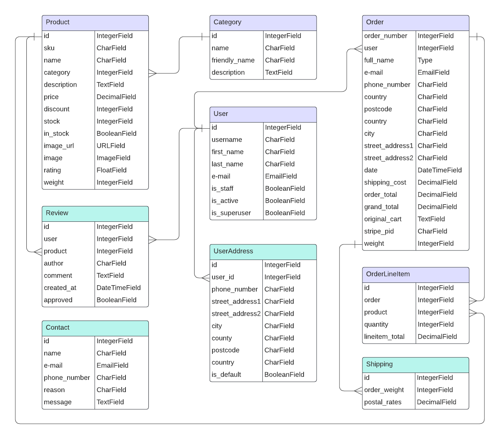

    From the very beginning of the project, I knew that I first needed to understand the structure of the database and the relationships between tables. I have created a database schema to help me with this. 
    The preplanned structure of the database underwent some changes during the work on the project:

    - `phone_number` field was moved from `UserAddress` table to `UserProfile`(`User`) table
    - In the pre-planned database schema I forgot to include the `rate` field in the `Review` table. It was included in the real db version
    - In the `Contact` table the `reason` field was removed as unnecessary   

    The database tables are arranged according to django apps as follows:

    - Products App: Product Model, Category Model, Review Model
    - Profiles App: UserProfile Model, UserAddress Model
    - Checkout App: Order Model, OrderLineItem Model
    - Cart App: Shipping Model
    - Contact App: Contact Model

### 
Design

The site design is intuitive and functional. Google fonts Lato (body) and 'Merriweather' (headers) have been used to customize the default Bootstrap fonts. Sans Serif was chosen as the backup font.
The color scheme was chosen to match the colors of the logo and reflect both warmth and friendliness, as well as energy and innovation. Coral color of the headings should attract the attention of customers. 
The following color palette was used from [Coolors](https://coolors.co/):

#### Wireframes

> index.html

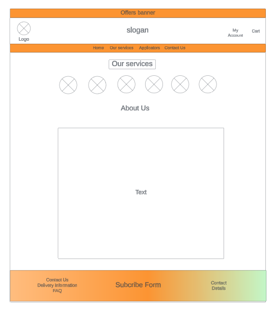

> products.html

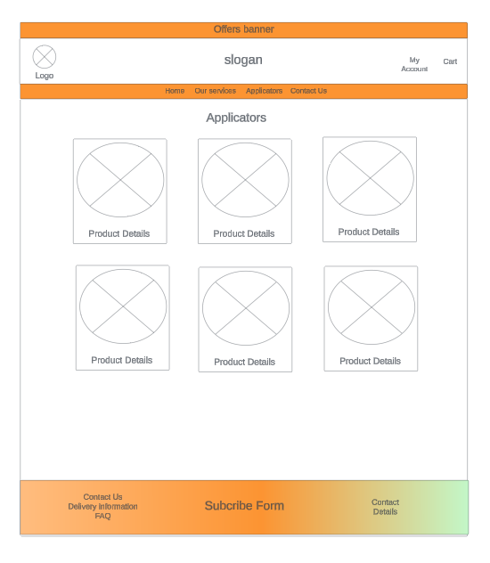

> product_detail.html

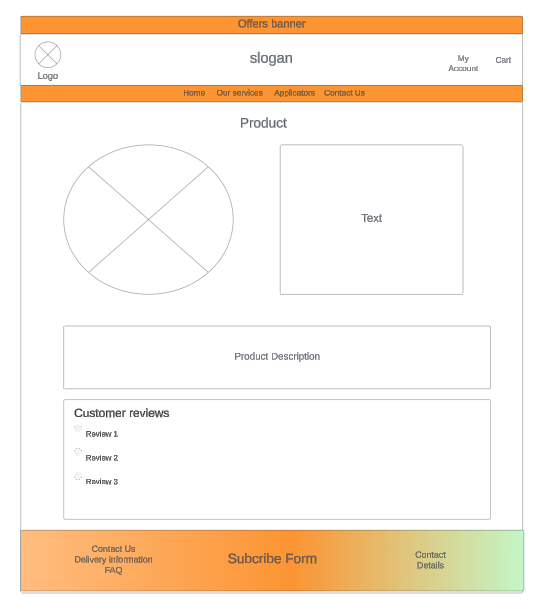

<a href="#up">Back to Top of page</a>

---

## 
SEO and Marketing

By using short-tail keywords and analyzing the results of Google trends and related topics, I was able to create a list of long-tail keywords. Keywords are used in various places on the site, including photo titles. When necessary, I use the `strong` tag and make sure all links are described correctly.

I created a sitemap.xml and robots.txt files so that once ready engines like Google could search and crawl the site efficiently. I blocked the `Profiles` app because it doesn't make sense for Google to crawl those pages.

I created a [Facebook business page](https://www.facebook.com/profile.php?id=61555937112755) as the foundation of a social media marketing strategy.
In case the page becomes inactive or deactivated by Facebook, I also took screenshots to display here:

  

---

## 
Testing

### Manual testing

Due to the large scope of the project, thorough testing was carried out by the developer and numerous users among friends and acquaintances. Usability suggestions were reviewed and taken into account.
All design features have been manually tested and everything works as expected. Testing was completed on my local terminal as well as Heroku deployment.

- Testing for responsiveness was conducted using Chrome Dev Tools. The website was tested extensively on a range of emulated mobile, tablet and large format screen sizes in both portrait and landscape orientations.<a href="#responsiveness">(Testing results are here)</a>

- All HTML files were passed through the W3C validator with no errors.
- CSS files were passed through the W3C validator with no errors.
- The website was tested on browsers Chrome, Firefox, Edge and Opera.
- All user flows were tested, including navigation, link clicks and form submissions.
- All forms have been tested to ensure they are validated and can be submitted without errors.

The steps and results are as follows.

#### 
Testing User Stories 

| User story        | User story testing |
| ------------------ | ------------- |
| As a user, I can view a list of products so that I can decide if I wish to purchase anything. | Without logging in the user can access a list of products by clicking on the `Store` in the navigation menu to open the dropdown menu. The user clicks `Applicators` to view all the products or chooses a category name to view products from a specific category. The product listing includes a product image, name, price, category and rating. The user can navigate through categories by clicking on the category name at the dropdown menu, at the top of the store pages or in the information about each product. |
| As a user, I want to see detailed product information so that I can decide whether to make a purchase based on the price, description and option availability.| The user clicks on the product image or product name on the store page to open full product information. The product detail page displays a detailed description of the product and below it a list of reviews (if any) with an individual customer rating. The final product rating is calculated as the average of all individual ratings approved by the admin and is shown in the product information. The functionality for displaying the availability of goods in stock is not implemented in the current project due to time constraints and has been added to future features. |
| As a user, I can navigate the website easily and intuitively so I can explore the website freely.  | All navigation links on the navigation bar are working properly and bring the user to the correct page. The logo image link allows the user to return to the home page from each part of the site. The drop-down menu of our services contains links to pages of offered services with images and detailed descriptions of each. The hamburger menu is present on medium and small devices and expands to show the main navigation links. |
| As a user, I want to be able to browse products so that I can easily find what I'm looking for. | The user can search for products in the store by keywords using the `Search our store` field. The search is carried out using keywords contained in the title or description of the product. The search result appears in the top left on large screens and in the center of the page on medium and small screens. |
| As a user, I can create an account so that I can access my personal information and order history. | The user can create an account by entering their username, email address and password. After filling out the registration form, the user receives an email with a verification code to confirm the authenticity of the e-mail address. By clicking on the link in the email and going through the verification process, the user can log into their account. |
| As a registered user, I can view my order history so that I know what I have already ordered. | A registered user can log into their account by clicking `My Account` icon in the upper right corner of the navigation bar. On the profile page, a side menu of 3 options is available: `Personal Information`, `Addresses` and `Orders`. By clicking on `Orders` the user’s order history with order number, date and order total is available. By clicking on the order number, detailed information about a specific order appears. |
| As a registered user, I can edit my user information so that I can have the correct information. | On the user profile page, the user can edit his personal information (first name, last name and phone number). Because the username and email address are unique and are used for authorization, there is no way to edit them. On the addresses page, the user can add a new address, edit an address, delete an address and set the default address (CRUD). To prevent accidental deletion of information, the user is asked to confirm the deletion. |
| As a customer, I can add items to a cart so that I can navigate to other products without losing my order. | User can add products to the cart by clicking `Add to cart` on the product detail page in the store. During the navigation of the site, the items in the cart are saved. The quantity of goods in the cart is indicated by a number next to the cart icon in the upper right corner. |
| As a customer, I can remove items from my cart to change my selections or not place an order. | When a user enters a shopping cart, he sees `update` and `remove` buttons next to each item. The customer can increase or decrease the quantity of an item, and also remove an item. When all items in the cart are removed, the message `Your cart is empty` appears. |
| As a customer, I can receive a message on the changes I make to my cart so that I know if the items were added, deleted or updated successfully. | The user is notified with a success message when an item is added or removed from the cart or the quantity is updated. The success message also shows information about the contents of the cart. |
| As a customer, I may receive an email notification that my order has been successfully placed so that I have order confirmation. | When the order is successfully placed and paid, the user will receive an order confirmation by email. This notification contains complete information about the placed order, namely: order number, date, order total, delivery charge, grand total, user contact phone number and address to which the order will be sent. This confirmation also contains the seller’s email for contact in case of any questions.|
| As a customer, I can complete the payment process quickly and easily so that the information is keeped secure and private. |User fills in all necessary information on the Step 1 of order checkout. The error message shows when fields are incorrectly completed. After verification, the user proceeds to Step 2 of the checkout process, where he enters card details for payment and completes the purchase. Success message and order confirmation message are displayed to the user when order is completed. Payment success shown in Stripe dashboard. Order confirmation email sent to user. |
| As a user, I can post reviews on items that I have purchased so that I can advise others if this product is worth purchasing. | After placing an order, the user can see all completed orders in his profile in the `Order History` section. When he clicks on the order number, detailed information about the order opens, and `Leave Review` button appears next to each item. When the user clicks on the `Leave Review` button, a form opens in which the user can write his name, a comment about the product, and also rate the product (from 1 to 5). When a user submits a review, a message appears indicating that the review will be published after admin approval. |
|As a customer, I can view a list of reviews for each product so that I can find out if customers are satisfied with the product. | A list of all approved reviews is displayed on the detailed product description page.  |
| As a customer, I can view each product rating to know how good this product is. | The rating for each product is reflected in the form of stars (from 1 to 5) and is calculated as the average rating value of all approved reviews. The product rating is reflected both on the main page of the store and the detailed description page of the item. |
| As a customer, I can sign up for a newsletter so that I can get access to special offers or promotions.| The user can subscribe using their email to receive newsletters from the company are notified with an on-screen message if the request is successful. Mailchimp form is integrated into the footer and is available on all pages of the site. |
| As a customer, I can contact the business owner so that I can communicate with a person. | `Contact Us` page is accessible from the main navigation bar at the top of each page, and a link to this page is added at the end of each `Our services` section for customer convenience. On the `Contact Us` page, the customer can fill out a `Contact Form` and ask any question to the business owner. The business owner receives confirmation of the new contact form to their email address.|
| As a store owner, I can manage orders based on queries from customers so that the orders are correct. | The store owner can manage all customer orders using the Django admin panel. The ability for the store owner to access all customer orders from the frontend interface is not implemented in this project due to time restrictions and is included in future features. |
| As a store owner, I can add, edit and delete products in the store so that I can effectively manage store operations.| The store owner, as a superuser, has access to add, edit and delete products. To add a new product to the store, a superuser can navigate to `My Account`, `Product Management` on the top right side of the navigation bar. Editing and deleting a product is possible using the `Edit` and `Delete` buttons displayed both on the main page of the store and on the detailed product description page next to each item. To prevent accidental deletion, a message appears asking store owner to confirm the operation.|
| As a store owner, I want to be able to set and change shipping rates to match carrier's rates.| The store owner can access `Shipping` table through the Django admin panel and change the shipping cost to match the carrier's rates. The cost of order delivery is calculated based on the weight of each item and the carrier’s prices. |
| As a store owner, I can use web marketing so that I can increase website traffic and sales.| A Facebook business page was created to attract and promote this business to customers through social media.
| As a store owner, I want sitemap.xml file, robots.txt file, keywords and Meta tags to boost the SEO so that this business reflects as professional on google search and this website is crawlable by google spiders. | To boost the SEO of this business, keywords were created and placed on all pages. Meta tags were added to the website to display relevant and correct information in searches so that this business would appear professional in Google searches and so that the clients would trust it. So that this site can be crawled by Google robots, a robots.txt file was created. Created a sitemap so all site links are disclosed for submission to Google. |

<a href="#up">Back to Top of page</a>

---

#### 
Testing Features

Please see a table of acronyms used throughout testing:

| Key |  Value|
| ------------------ | ------------- |
| NLI | Non logged in user |
| LIU | Logged in user who does not have staff permissions |
| SUS | Superuser or staff permissions |

##### Navigation links

| Test |  Result |
| ------------------ | ------------- |
| NLI can access all links and pages except the link to `My Profile` of the `My Account` menu. |  NLI can access Home page, Our Services pages, Store pages and Contact Us page. All navigation links on the navigation bar are working and bring the user to the correct page. NLI can navigate to the home page by clicking the logo in the page header.
| NLI can navigate the store easily and intuitively. | NLI can navigate through product categories by clicking on the category name at the dropdown menu and at the top of the store pages. NLI can access the current product category from the product detail page. |
| NLI can access registration and login pages. | NLI can click to `My Profile` on the right side of the header and select `Login` from dropdown menu to be redirected to the login page. For signing in NLI can click `Register` from the same dropdown menu to be taken to the sign in page. |
| LIU can access profile page and log out.  | LIU can view `My Profile` and `Logout` links of the `My Account` menu in the right side of the page header.  |
|LIU can access their personal information. | Having logged into their profile, LIU sees a side menu of 3 items: `Personal Information`, `Addresses` and `Orders`. On `Personal Information` page, the user can edit personal data (first name, last name, phone number). Because username and e-mail should be unique, there is no way to change them.|
| LIU can log out of their profile.| User can click `Logout` button on the navigation bar and log out of their profile. |
| SUS can access Product Management and Review Management pages | SUS can click to `Product Management` on the right side of the navbar and access the page to add product to the store. SUS can edit and delete products using the `Edit` and `Delete` buttons displayed on both the store's home page and on the product detail page next to each product. |
| SUS can approve the reviews.| By clicking on `Review Management` link, SUS can see a table with all the information from the review that the user posted. After checking this information, SUS clicks `Approve` button so that the review is published. |

##### User Forms

| Test |  Result |
| ------------------ | ------------- |
| NLI can create account.| NLI is redirected to the registration page by choosing `Register` link from `My Account` dropdown . NLI can also access registration page from `Login` page. They are asked to register if they don't already have an account. The registration form has error handling built in so the NLI must make the correct inputs. If inputs are incorrect the user is shown a message about incorrect data entry. The verification code is sent to the email specified during registration. To confirm registration, NLI must open the email and click on the link. NLI is redirected to the site page to confirm verification. If registration is successful, a message `Your account is created successfully` is displayed to the user. |
| NLI can log in.| NLI is redirected to the login page by choosing `Login` link from `My Account` dropdown. NLI can also access login page from registration page if they have an account. After authorization the message `You are successfully logged in as <username>` is displayed. If the username or password is incorrect, the message `The username and/or password you specified are not correct` is displayed to the user. |
| NLI can fill out the `Contact Form`| On the `Contact Us` page, NLI can fill out a `Contact Form` and ask any question to the business owner. The form contains the following fields: `Name`, `E-mail`, `Phone number`, `Message`. The fields `E-mail` and `Phone number` are verified to ensure they comply with the format. The `Message` field has a maximum length of 500 characters to avoid spam and limit message length.|
| LIU can edit  their personal information. | On the profile `Personal Information` page, LIU can click the `Edit` button to change their personal information (first name, last name, phone number). Because the username and e-mail should be unique, there is no way to change them.|
|LIU can create, read, update and delete (CRUD) their addresses. | From the profile `Addresses` page LIU can add a new address, view all saved addresses, update and delete any address (CRUD) except `Default address`. Fields `Street Address Line 1`, `City` and `Choose a county` are required. When editing an address, LIU can set a specific address as default. To prevent accidental deletion, a message appears asking the LIU to confirm deletion of a specific address.|
| LIU can leave a review on the purchased product.| By going to `My Profile >> Orders` and clicking on the order number, detailed information about the order opens, and `Leave Review` button appears next to each product. By clicking on the button, a review form opens and LIU should fill out all the following fields: `Author`, `Comment`, and also check the product rate box (rate it from 1 to 5). When LIU submits a form, a message appears indicating that the review will be published after admin approving. |
| User can complete the order by filling out the checkout form. | User fills in all necessary information on the Step 1 of order checkout form. The error message shows when fields are incorrectly completed. Custom verification methods have been added to `Full Name` and `Phone Number` fields. Under the checkout form, NLI is asked to create an account or log in, and LIU is asked to save data to their profile. After user data verification, the user proceeds to Step 2 of the checkout process, where he enters card details for payment and completes the purchase. If the order fails due to incorrect information being submitted the order will not be submitted. If there is an error when processing the order the site returns a 500 error without processing the order. |

<a href="#up">Back to Top of page</a>

---

#####  Security Tests

| Test |  Result |
| ------------------ | ------------- |
| NLI cannot access profile page.| The link to the profile page is visible only to authorized users. If NLI tries to access profile page by direct link, he is redirected to the login page. |
| Non SUS cannot access admin panel.| The admin panel is accessible only to the user with a superuser login and password. |
| NLI cannot leave a review.  | `Leave Review` button is accessible only from the user profile. NLI is redirected to the login page when trying to load the review page via a direct link. |
| LIU can only leave reviews for products he has purchased. | If LIU tries to go to a page with a link to a product that is not in their orders, or to a product with an order number that is not in their order history, `404 error page` is displayed.|

##### Admin Tests

| Test |  Result |
| ------------------ | ------------- |
| Admin can view data in database tables.| Admin can view all data from database tables through django admin.  |
| Admin can add products to the store.| Admin can access `Product Management` from `My Profile` dropdown and add a product to the store by filling out all the required fields and uploading a product picture. |
| Admin can edit and delete store products. | Admin can edit and delete products using `Edit` and `Delete` buttons displayed on both the store's home page and on the product detail page next to each product. To prevent accidental deletion of a product, transaction confirmation is required. |
| Admin can manage the reviews. | Admin can access `Review Management` from `My Profile`dropdown to approve a user's review.  After confirming a review for a specific product, the product rating is automatically recalculated as the average rating value from all confirmed reviews.|
|Admin can edit items in database. | Admin can access all fields in the database tables and make any changes except `readonly` fields. |
|Admin can delete items in database. | Admin can access all fields in the database tables and can delete a model instance. Any objects which had foreign keys pointing at the object to be deleted will be deleted along with it.|

#### 
Responsiveness Testing

Testing for responsiveness was conducted using Chrome Dev Tools. The website was tested extensively on a range of emulated mobile, tablet and large-format screen sizes.

| Device |  Resolution  |   Result  |
| ------------------ | ------------- | ------------- |
| Samsung Galaxy S8+|  360 x 740  |   Pass  |
| iPhone 6/7/8 |  375 x 667  |   Pass  |
| iPhone X |  375 x 812  |   Pass  |
| iPhone 12 PRO |  390 x 844  |   Pass  |
| Samsung Galaxy A51/71 |  412 x 914  |   Pass  |
| iPhone XR |  414 x 896  |   Pass  |
| iPad Mini |  768 x 1024  |   Pass  |
| iPad Air |  820 x 1180  |   Pass  |
| iPad Pro |  1024 x 1366 |   Pass  |
| HP Laptop 14s |  1920 x 1080|   Pass  |

<a href="#up">Back to Top of page</a>

---

### 
Bugs

##### Review Form processing bug

- When processing data from the Review Form, the following issues occurred:

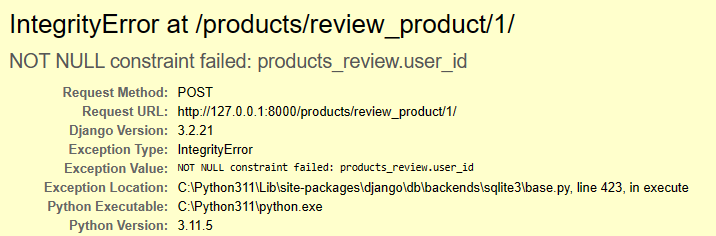
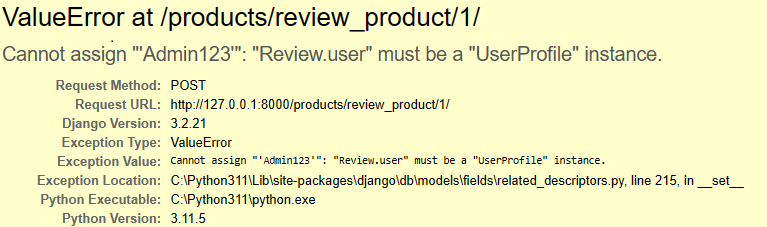

The issue was resolved by properly configuring the user profile instance:

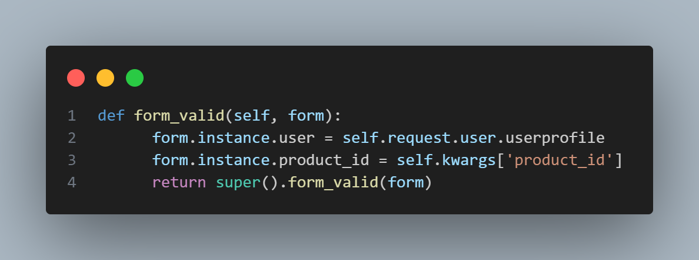

##### Review Form reverse url bug

- When trying to generate a reverse URL in the ReviewView(CreateView) class, the following errors were received:

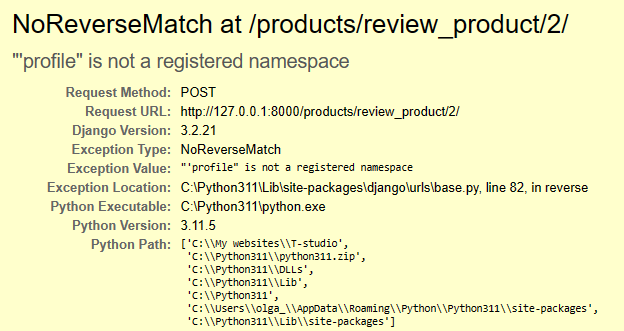
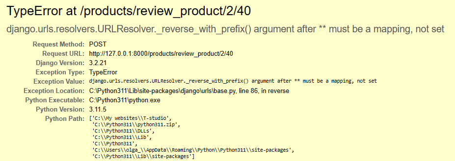

Steps to solve:

1. Create a namespace for profile app in main urls file, add app_name to profile urls file
2. Correct all links to profile view functions.
3. Send product_id and order.id to review_product function.
4. Add `get_success_url` method to ReviewView.
5. Create reverse url in correct format to pass order_id as a part of this url:
 `'profile:order_details, kwargs={'order_id': self.kwargs['order_id']}'`:

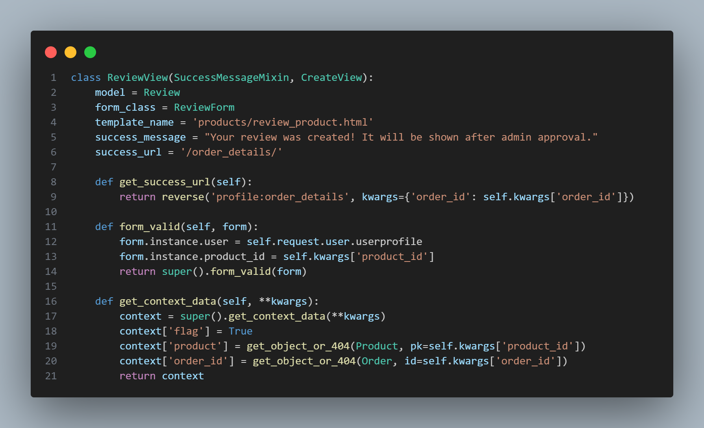

##### User Data Prefill bug

- When trying to pre-populate the checkout form with user profile information, the following issue occurred:

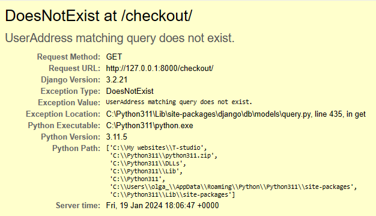

In the process of investigating the problem, it turned out that to process the form correctly, it is necessary to obtain data in the `full_name` field by combining `first_name` and `last_name` fields data, which are stored in the `UserProfile` model. This was done as follows:
`full_name = UserProfile.objects.annotate(full_name=Concat('first_name', Value(' '),last_name')).get(user=request.user).full_name`

 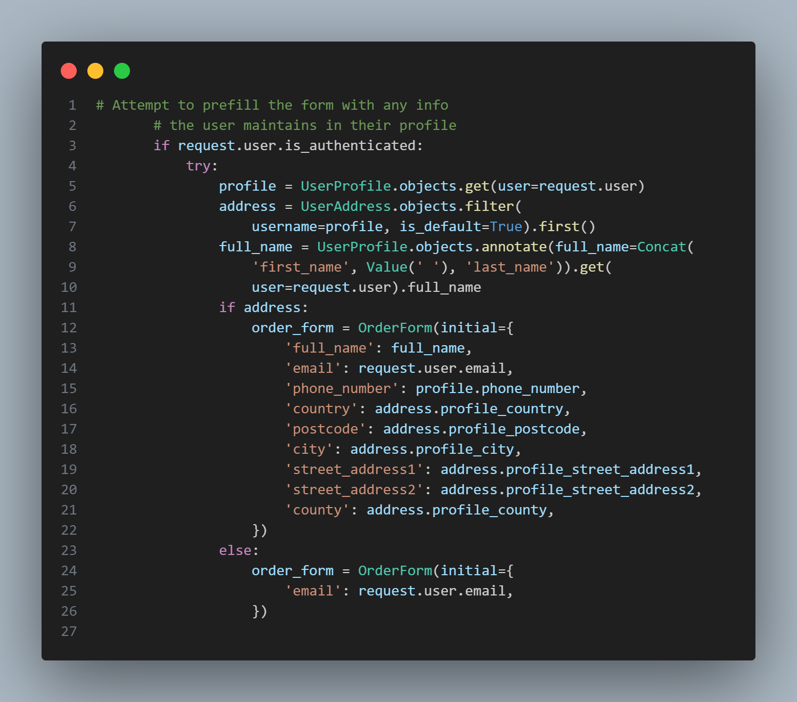

##### Confirmation e-mail sending bug on production server

- The confirmation email was not sent from the production server and the following error occurred:

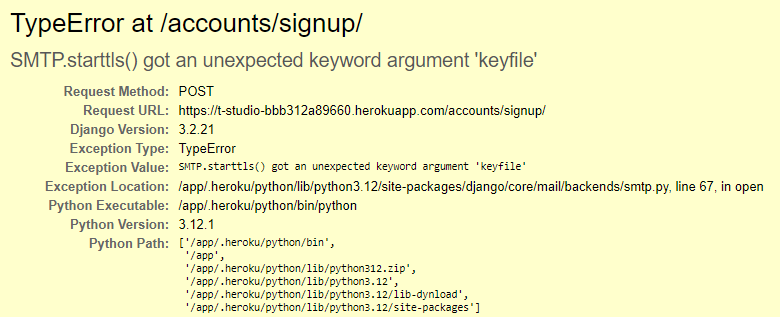

After numerous attempts to solve the issue using Google search, slack community, etc., I decided to contact Tutor support. It only took 5 minutes to get the correct solution from them:

 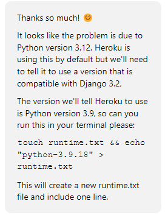

I ran the above command in my terminal which created a runtime.txt file containing 1 line (python-3.9.18) and the issue was solved.

<a href="#up">Back to Top of page</a>

---

### Google Lighthouse Testing

Site pages have been tested using Lighthouse to identify performance and accessibility issues and ensure best practices are followed.

> Homepage (index.html)

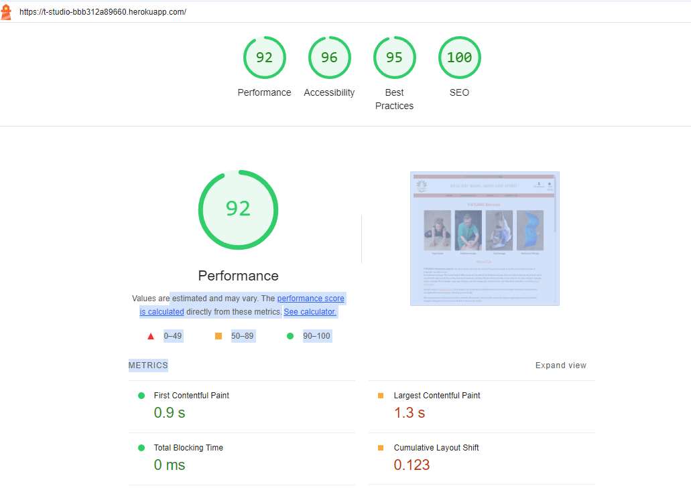

> Products (products.html)

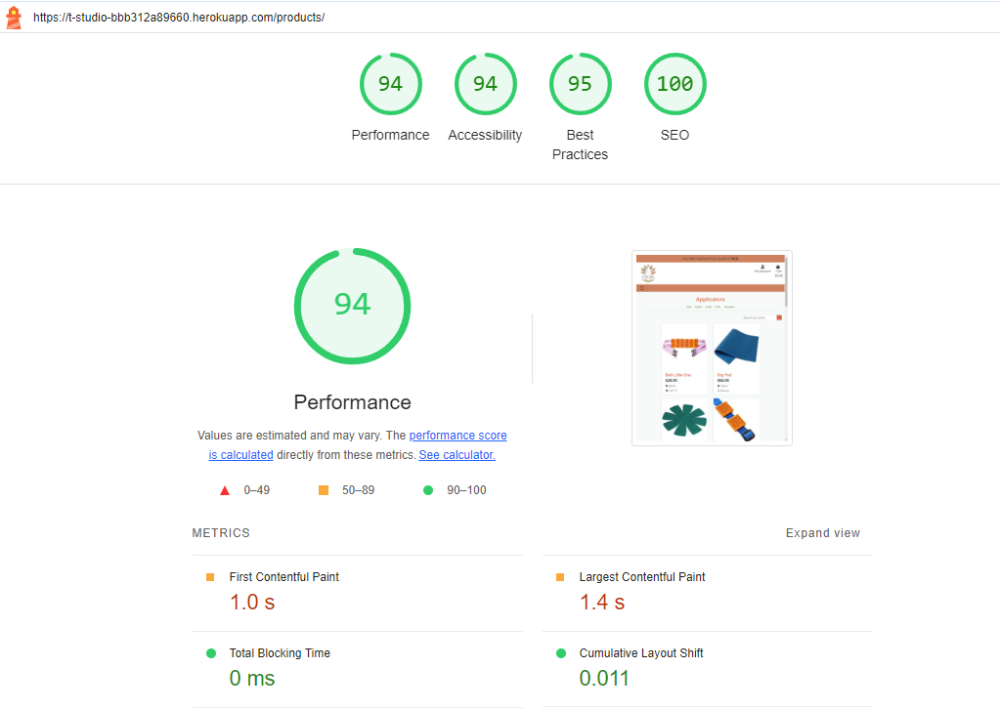

> Contact Us (contact.html)

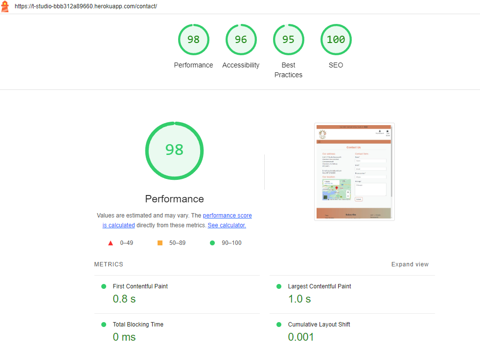

### HTML W3 Validation
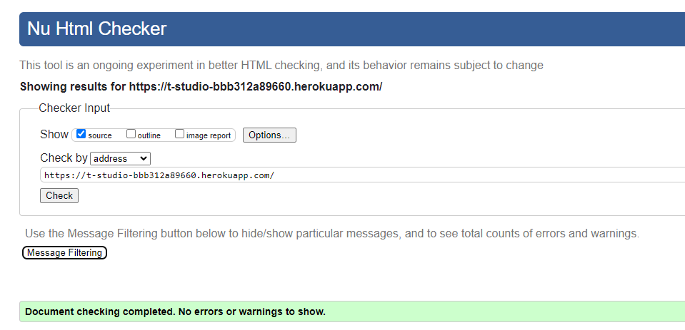

Result: no errors or warnings.

### CSS Validation
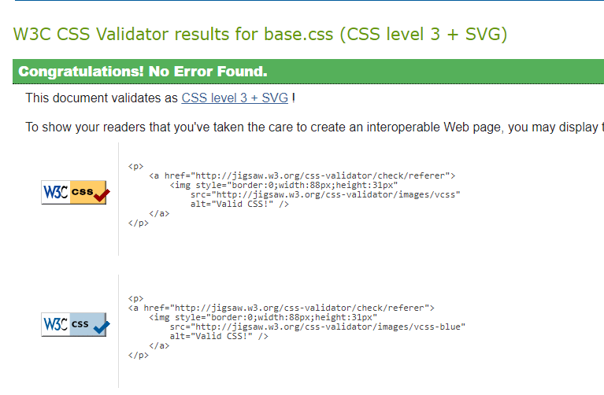

Result: no errors.

### Python Validation

The only issues found in any of the Python files when running through the Pep8CI online validator were due to trailing whitespaces and too long lines, and have been fixed.

Result: no errors.

### Javascript Validation

JavaScript code passes through [Jslint](jslint.com) with no significant issues.

<a href="#up">Back to Top of page</a>

---

## 
Existing Features

### Navigation

The main navigation is located in the header and is present on all pages (fixed at the top). The hamburger menu is present on medium and small devices and expands to show the main navigation links.

The header contains the offers carousel banner,  the site logo, slogan and main navigation links with two dropdown menus `Our Services` and `Store`, `My Profile` dropdown list and a shopping cart item.

When developing this project, I decided to add a detailed footer to it and duplicate links to `Our Services` to improve UX. I have included a subscription option in the footer that allows customers to submit their emails to be added to mailing lists with offers and discounts. This service is provided by mailchimp. The footer also contains contact information and a link to `Contact Us` page, as well as social media links.

### Our services pages

`Our services` section consists of the following pages: `Yoga`, `Yoga Therapy`, `Thai Massage`, `Medical Massage`, `Electrical Stimulation`, `Mechanical Therapy`, `Joint Manipulations` and `Baby Massage`. Each of the above pages contains a detailed description of a specific service with a link to the `Сontact Us` at the end of the page. I am not providing screenshots of all `Our services` pages here because they have the same template and only the text and pictures differ.

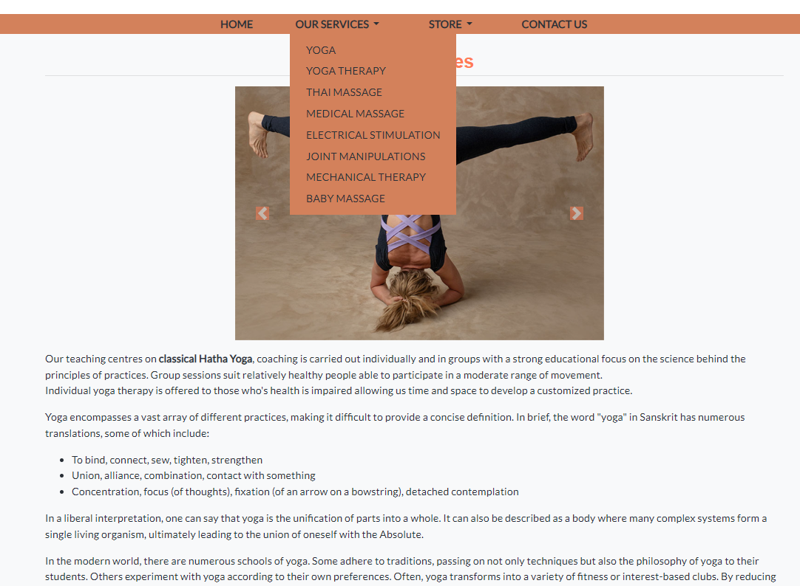

### Product pages

The `Store` menu dropdown consists of the following categories: `All applicators`, `Mats`, `Rollers`, `Bands`, `Belts` and `Massagers`. The Store page contains product cards. Each card contains an image and heading with the product name inside an anchor element, that links to the product detail page of the item. The product card also contains the product price, category and product rating (if there is no rating, then `No rating` is shown).

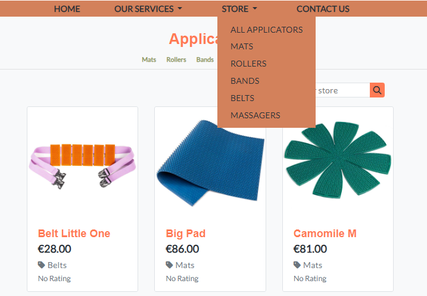

You can navigate through categories in three ways: from the top dropdown menu, from the additional menu at the top of the store page and from the card of each product.

The page has a search field that checks the words the user types to see if they appear in the product name or description. Search results are displayed at the top of the page.

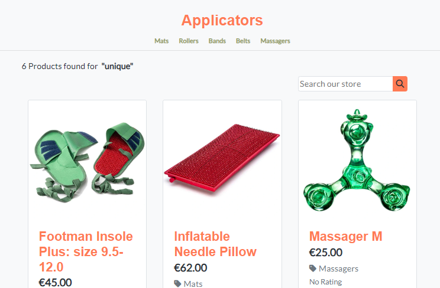

### Reviews

The product detail page displays a detailed description of the product and below it a list of reviews (if any) with an individual customer rating. The review rating is calculated based on the average score of approved by admin reviews. The product rating is recalculated every time the product page is loaded to avoid errors in the event of an admin accidentally deleting a review in db.

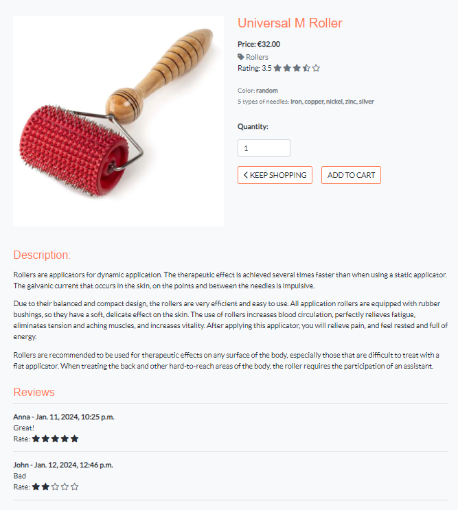

### Authentication

Authentication flows come from Django Allauth and are designed to fit the project style. The `Sign Up` form contains the fields needed to create a user account. The user also can click the `Sign In` link to be redirected to the login page. If not all required fields are filled in or are filled in incorrectly, a user will receive an error notification.

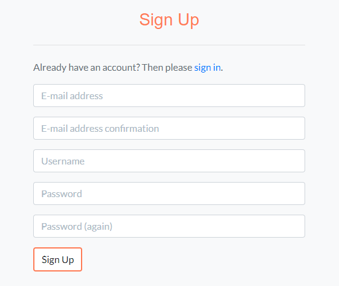

When a user registers, a confirmation email is sent to their email address to confirm before they can access their account.

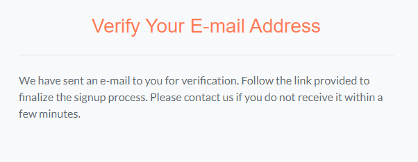

After confirmation of verification, the user is redirected to the `Sign In` page. On the `Sign In` page, the user enters their login and password. If the details entered are incorrect, they will receive an error notification.

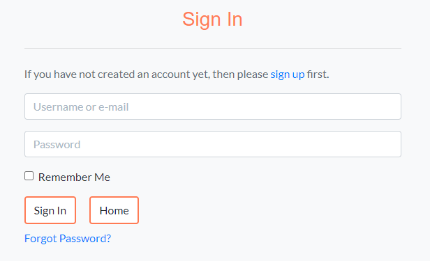

### Shopping Cart and Checkout

The cart items section displays a thumbnail image of the product, name, price, quantity and subtotal of each cart item. Every item has `update` and `remove` buttons allowing users to modify their cart without having to return to the products page.
The total, shipping cost and grand total are displayed at the bottom with the option to proceed to payment or to keep shopping.

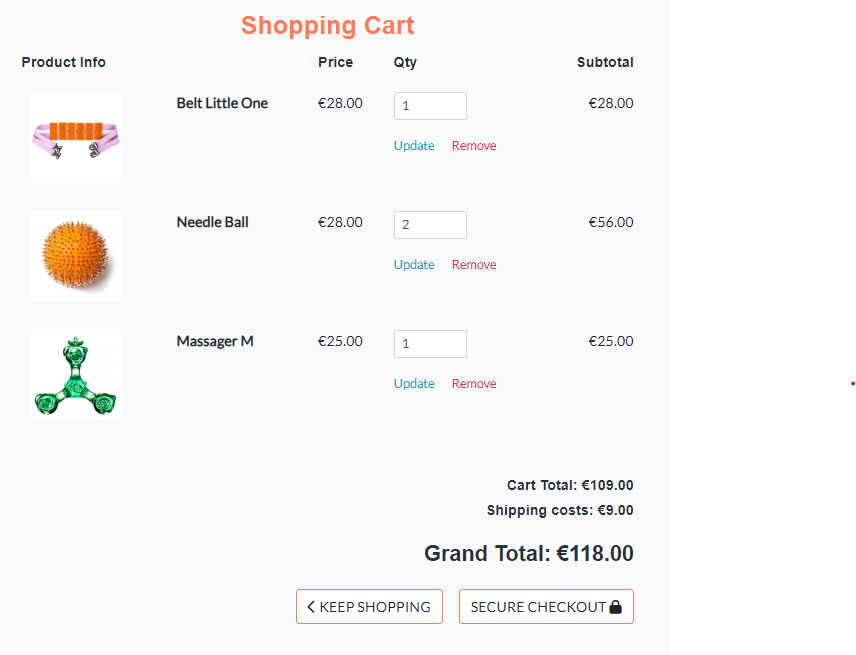

The cost of order delivery is calculated based on the weight of each item and the carrier’s prices, which are stored in the database.

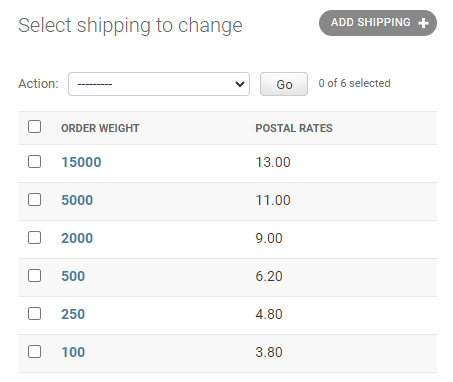

If a user changes the quantity of a particular product option in their cart, they will receive a success message with details and the cart total will be recalculated.

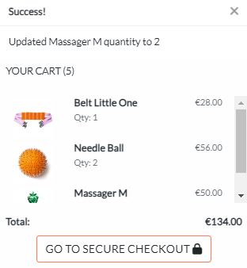

If a user removes an item from their cart, that specific product option will be removed, a success message will be displayed, and the cart total will be recalculated.

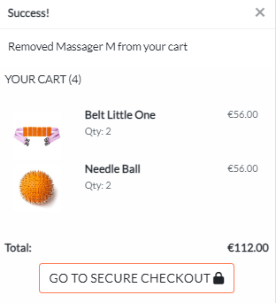

If the user has no items in their cart, the following view will be displayed:

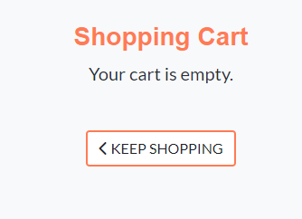

On proceeding to Step 1 of Checkout the user can complete the shipping information and see a summary of their order. Shipping information is pre-populated for the logged-in user if this has been populated in their profile. Alternatively, they can choose to save the completed information to their profile.
Products can only be delivered within the Republic of Ireland, a warning about this is displayed before the checkout form, and the country field on the shipping form is not shown to the user.

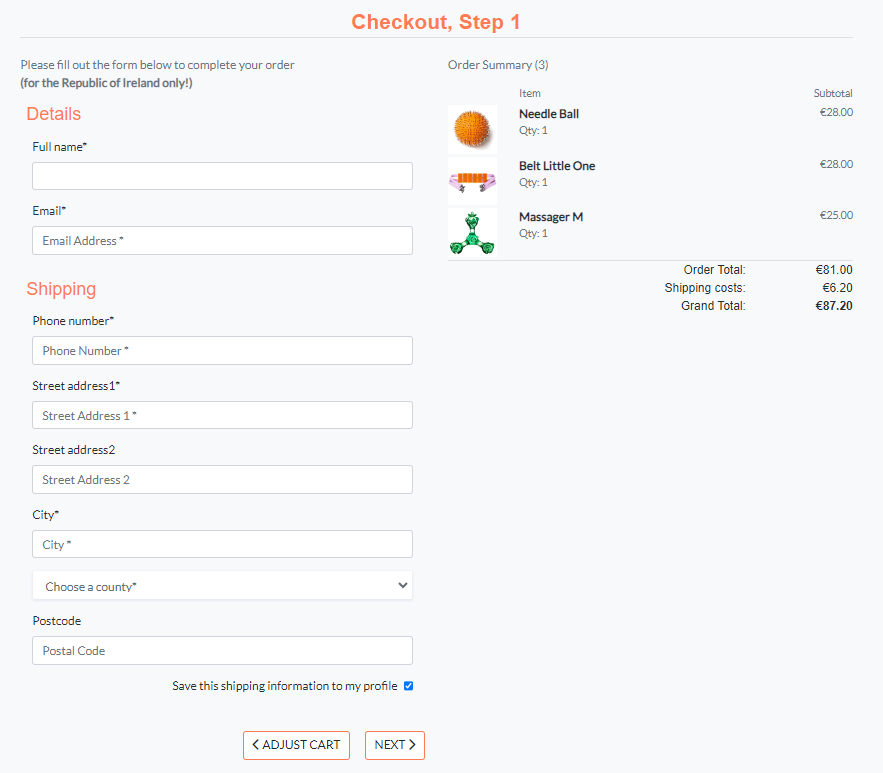

If any required information is not completed, verification messages are displayed. Custom verification methods have been added to `Full Name` and `Phone Number` fields. If the details entered are incorrect, an error message is displayed as well.

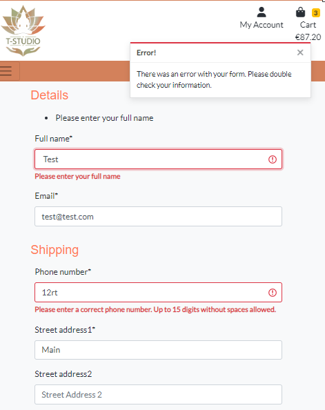

After user data verification, the user proceeds to Step 2 of the checkout process, where he enters card details for payment and completes the purchase. If necessary, the user can return to Step 1 of the checkout, and all fields will be pre-filled with the data that he entered before.

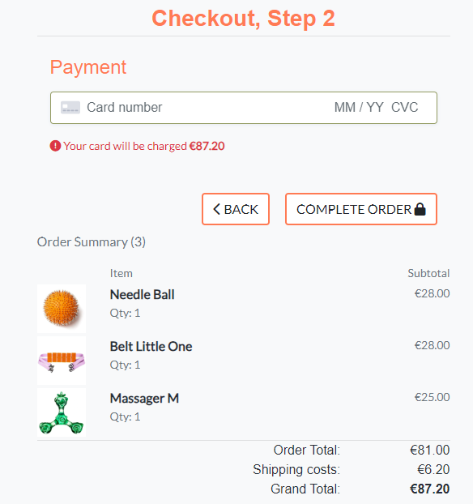

Once the payment is successfully processed, the user will be shown an order confirmation page and a success message. If the user is registered, the following text will appear with a link to their profile:
"You can leave your review on `profile page` by opening your order history".

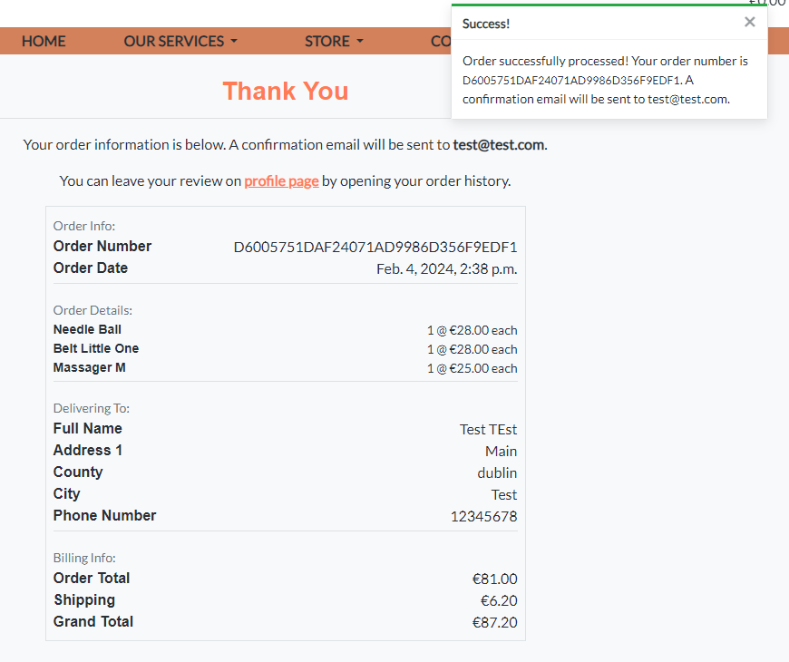

The user will also receive an order confirmation email to the email address registered when placing the order.

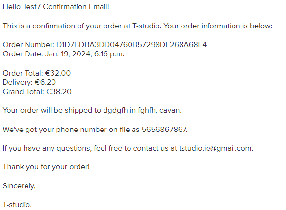

### Profile

The profile application has been designed to make it easier for customers to complete some basic post-order options. Implemented the ability to update the user's personal information, add, edit or delete a delivery address (CRUD), view order history and leave feedback.

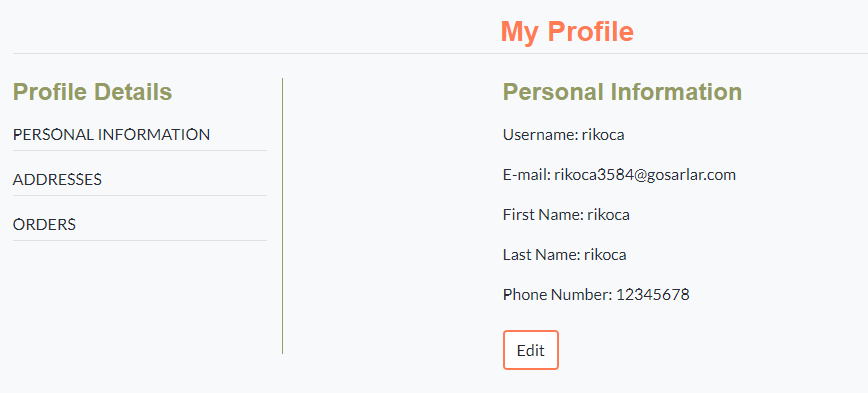

On `Personal Information` page, the user can edit personal data (first name, last name, phone number). Because username and e-mail should be unique, there is no way to change them.

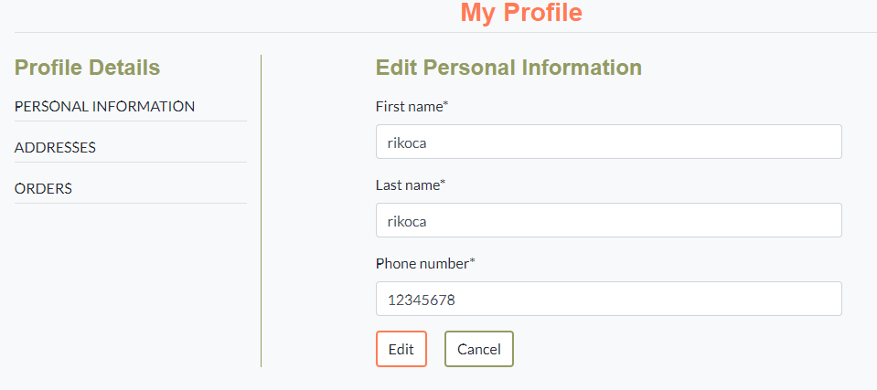

On the addresses page, the user can add a new address, edit an address, delete an address and set the default address (CRUD).

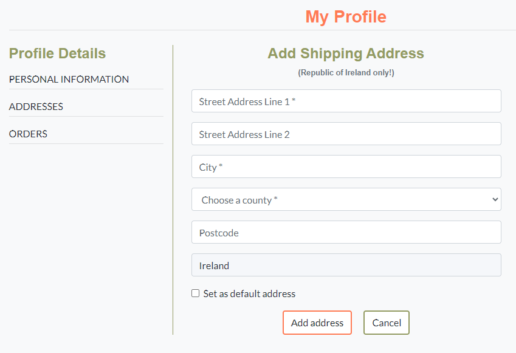

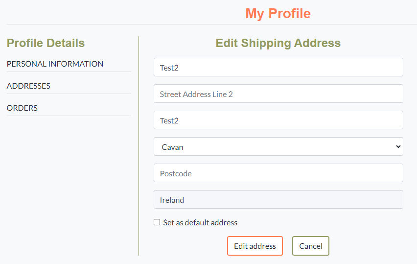

To prevent accidental deletion of information, the user is asked to confirm the deletion.

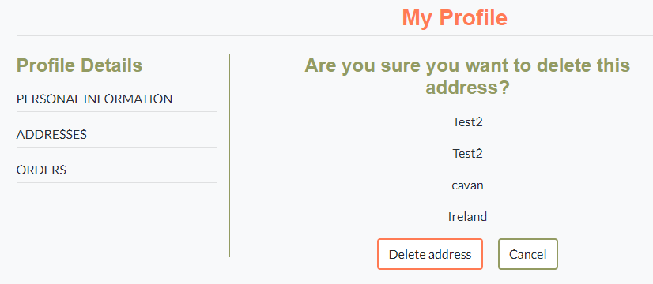

The user can set any address as default, and this address cannot be edited, because the user must have at least one address in their profile.

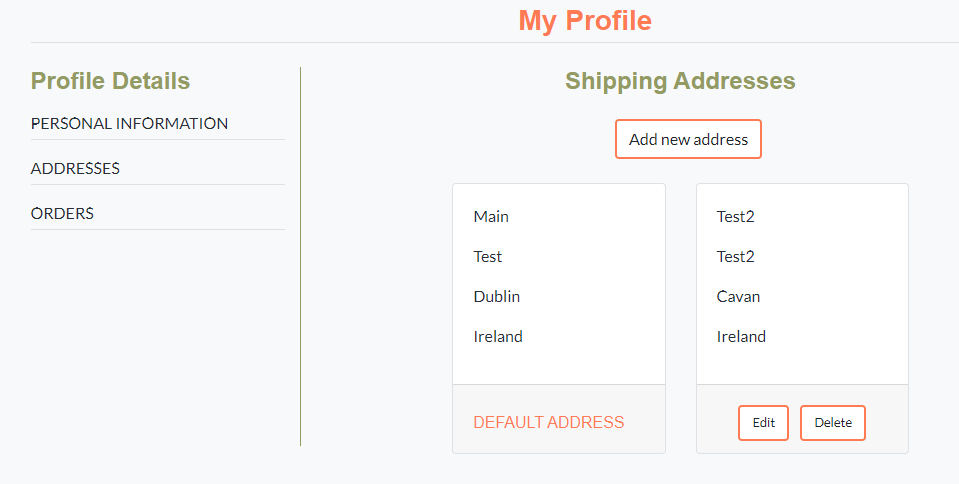

The user can access a list of their orders in the `Orders` section of their profile page.

By clicking on the order number user sees the detailed order information.
A `Leave a review` button appears next to each purchased product.

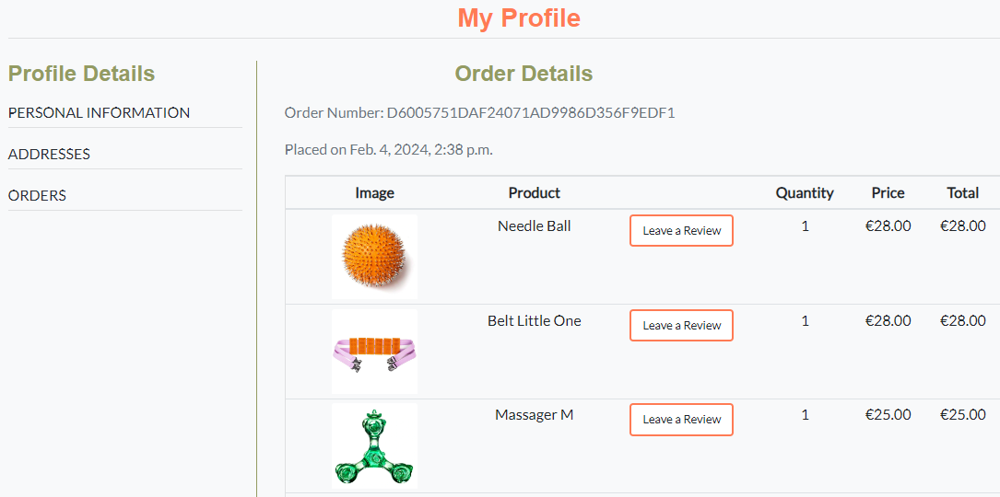

When the user clicks on the button, a review form opens. The user can write his name, a comment about the product, and also rate the product (from 1 to 5).

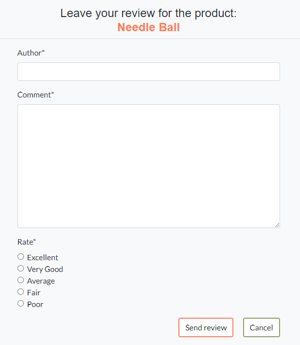

When a user submits a review, a message appears indicating that the review will be published after admin approval, and the user is redirected back to the order details page.

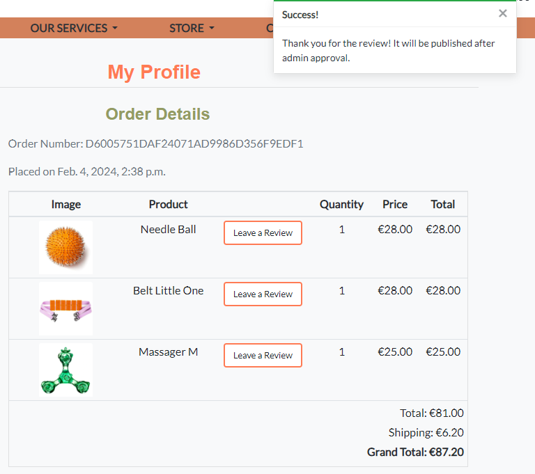

### Contact Us page

`Contact Us` page contains complete contact information of the business owner, a Google map indicating the location of the business and a contact form. The user can fill out a `Contact Form` and ask any question to the business owner.

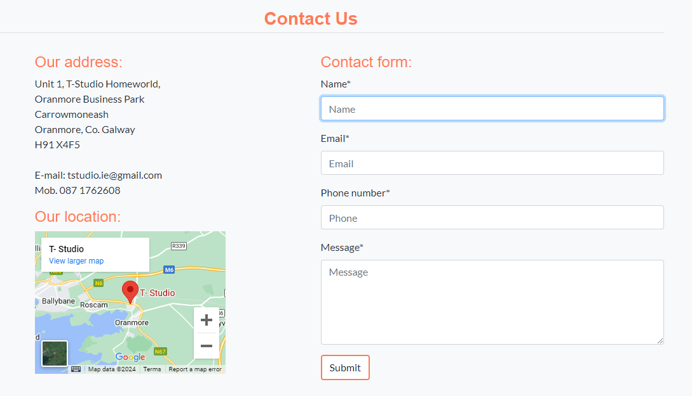

The business owner receives confirmation of the new contact form to their email address.

### Admin related permissions

When a superuser logs into an account, they receive additional permissions to edit, delete, and add products to the website and to approve reviews. Edit and delete options are available on the product details page, and the add product option is on the manage products page under the `My Account` dropdown list.

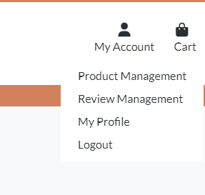

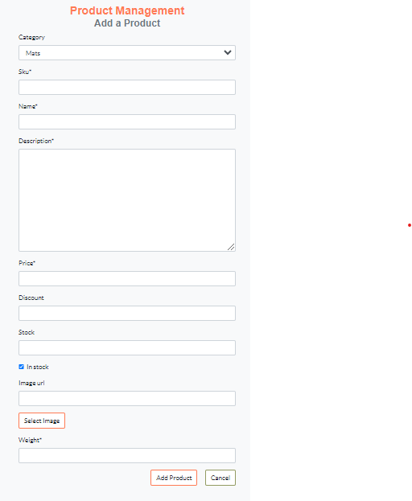

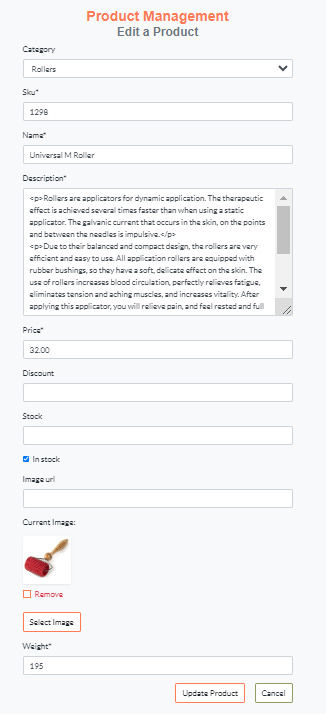

An admin can access `Review Management` from `My Profile` dropdown to approve a user's review. Once a review for a specific product is approved, the product rating is automatically recalculated as the average rating value of all approved reviews.

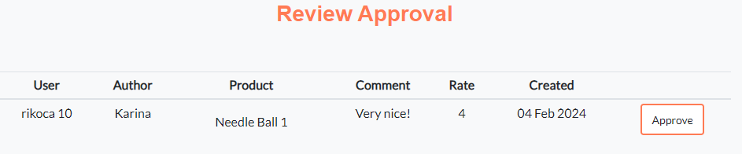

<a href="#up">Back to Top of page</a>

---

## 
Features left to Implement

- Allow the user to leave only one review for each purchased line item.
- Implement review pagination
- Implement the ability for the user to select a delivery address from all the addresses saved in their profile.
- Allow the user to make an appointment for a yoga class and/or a massage session.
- Implement admin access to all customer orders from the frontend template to manage them.
- Add functionality for changing warehouse stock balances after each customer purchase to manage the quantity of goods in stock.
- Track the delivery of the order and send the customer an email with a request to post a review of the purchased goods.
- Allow the user to unsubscribe from your newsletter so they no longer receive unwanted content.
- Create html pages with delivery information, refund policy and Frequently Asked Questions.

## 
Languages, Technologies & Libraries

Languages, Technologies & Libraries

### Languages:
- **Python**
- **HTML/CSS** + **Django Template Language**
- **Javascript**

### Libraries and Frameworks:
- **Django** framework was used to build this project. Provides a ready installed admin panel and includes many helper template tags that make writing code quick and efficient.
- **Bootstrap 4** was used as the base front end framework to work alongside Django.

### Technologies:

- **ElephantSQL** as a PostgreSQL database hosting service used for database.
- **AWS S3 and IAM** used to host static and media files for this project and IAM for the permissions-based roles for accessing the S3 buckets.
- **Font Awesome** for icons used on the website
- **Google Fonts** for site fonts
- **Stripe** for payment processing set up
- **Heroku** used for hosting the project
- **GitHub** used to store the code for this project & for the projects Kanban board used to complete it.
- **Git** used for version control throughout the project and to ensure a clear record of the work done
- **Privacy Policy Generator** for creation of a privacy policy
- **Favicon.io** for creation of favicon

